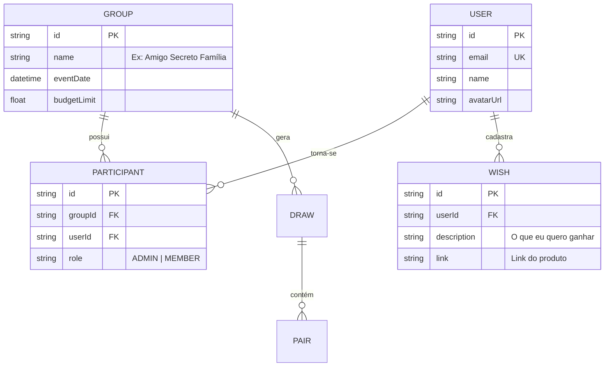

# 📐 Software Design Document (SDD) - Gift Hub!

**Projeto:** Gift Hub
**Versão:** 1.0.0  
**Status:** 🟢 Pronto para Implementação  
**Stack Principal:** NestJS, Angular, Prisma ORM, PostgreSQL.

---

## 🏗️ 1. Arquitetura do Sistema (Estrutura Monorepo)

O projeto utiliza uma arquitetura de Monorepo. O Agente de IA deve respeitar a seguinte estrutura de pastas:

* **`apps/api`**: Servidor Backend (NestJS). 
* **`apps/web`**: Aplicação Client (Angular 17+). 
* **`apps/extension`**: Vanilla TypeScript para manipulação de DOM.


## 🤖 2. Orquestração e Ecossistema de Contexto (MCP)
> **Instrução para a IA:** Este projeto utiliza o Model Context Protocol (MCP) para garantir a paridade entre especificação e execução. Sempre utilize as ferramentas abaixo antes de propor alterações estruturais.

* **GitHub Projects MCP:** Utilize para sincronizar o status das User Stories (PRD) com o desenvolvimento técnico. As definições de "Done" devem seguir os Critérios de Aceitação das Issues.
* **Neon.tech MCP:** Interface obrigatória para introspecção e migração do banco de dados PostgreSQL. O esquema gerado pelo Prisma deve ser validado contra o estado real do banco via este MCP.
* **Stitch MCP (Google):** Utilizado para a geração e prototipação de interfaces Angular. Consulte este contexto para garantir que os componentes sigam os padrões visuais e funcionais definidos no Stitch.

## 📦 3. Stack Tecnológica e Bibliotecas
### 🎨 Interface & Design System
* **Framework:** Tailwind CSS v3.x.
* **Component Library:** **DaisyUI v5.x** (Opção A).
* **Justificativa da Escolha:** A DaisyUI foi selecionada para este projeto devido à sua arquitetura baseada em classes semânticas, o que acelera drasticamente a prototipagem. Diferente de outras bibliotecas, ela permite a customização profunda dos Design Tokens diretamente no `tailwind.config.js`. Isso possibilitou a implementação fiel da estratégia visual "Curated Celebration", garantindo que componentes como botões e cards sigam rigorosamente a paleta violeta e o raio de arredondamento pílula definidos no protótipo do Stitch, sem inflar o bundle final da aplicação.

### Core & Infraestrutura
* **Ambiente:** Node.js v20.x LTS.
* **Banco de Dados:** PostgreSQL 16 (Hospedado no Neon.tech).
* **Backend:** NestJS v10.x.
* **Frontend:** Angular v17+ (Obrigatório o uso da nova Control Flow `@if`, `@for` e configuração estrita com `Standalone Components`. O uso de `NgModule` está proibido).
* **Styling:** TailwindCSS v4.
* **ORM:** Prisma v5.x (Interface oficial com o banco de dados).
* **Testes:** `jest` e `supertest` (Obrigatório seguir o padrão oficial do NestJS para testes unitários e E2E. Proibido o uso de Vitest, Mocha ou qualquer outro test runner).

### 🧪 Estratégia de Testes (Unificada com Jest)

O projeto adota o **Jest** como ferramenta única de testes para garantir consistência entre as camadas.

#### 🖥️ Backend (NestJS)

* **Unitários:** Foco em Services e Business Logic.
* **E2E (End-to-End):** Uso obrigatório de `supertest` para validar rotas e integração com Prisma/PostgreSQL.
* **Runner:** Jest nativo do NestJS.

#### 🌐 Frontend (Angular)

* **Unitários/Lógica:** Foco em Signals, Services de API e transformações de dados.
* **Component Testing:** Uso de `TestBed` com `jest-preset-angular`.
* **Atenção:** Proibido o uso de Karma/Jasmine ou Vitest.

### UI & Estilização (Frontend)

* **Design System:** DaisyUI.
* **CSS Framework:** Tailwind CSS v4.
* **State Management:** Angular Signals.

### Bibliotecas e Utilitários Permitidos
* **State Management:** Angular Signals.
* **WebSockets:** Socket.io v4.x (integrado via `@nestjs/platform-socket.io` v10.x).
* **Auth:** Passport.js + JWT (`@nestjs/jwt` e `@nestjs/passport`) para sessões seguras.
* **Validação:** `class-validator` e `class-transformer` (Obrigatório para os Pipes globais de validação de DTOs).
* **Documentação:** `@nestjs/swagger` (OpenAPI 3.0 para os contratos de API).
* **Utilitários:** `date-fns` (Para a lógica rigorosa de expiração do QR Code em 15s).

### 📚 Referências Técnicas e Instalação

> **Regra de Ouro:** O Agente DEVE consultar estas docs antes de executar comandos de scaffolding.

* https://angular.dev/guide/tailwind
* https://angular.dev/overview
* https://docs.nestjs.com/
* https://www.prisma.io/docs/postgres
* https://daisyui.com/docs/install/


## 🗄️ 4. Arquitetura de Dados

### 📖 4.1. Glossário Técnico (Mapeamento)
| Termo PRD (PT-BR) | Entidade Técnica (EN) | Atributos Principais |
| :--- | :--- | :--- |
| Usuário | `User` | `id, email, name, role` |
| Disciplina | `Course` | `id, name, code, professorId` |
| Chamada / Sessão | `Session` | `id, courseId, startTime, isActive` |
| Presença | `Attendance` | `id, sessionId, studentId, timestamp` |


### 🗄️ 4.2. Modelagem de Dados (Dicionário de Entidades)

> **Instrução para a IA:** Utilize este diagrama Mermaid como fonte da verdade para gerar o arquivo `schema.prisma` e as migrações do banco de dados.



## 📑 5. Contratos Globais (DTOs & Interfaces)
> Tipagem TypeScript para validação de entrada (Request) e saída (Response).

* **AuthDTO:** `{ idToken: string }` -> Retorna Token JWT + Perfil do Usuário.
* **CreateSessionDTO:** `{ courseId: string, durationMinutes: number }` (Exclusivo Professor).
* **CheckInDTO:** `{ qrToken: string }` -> O `qrToken` é um JWT assinado com validade de 15 segundos.

### 📂 5.1. Estrutura de Pastas Global (Workspace)
O projeto utiliza uma estrutura de Monorepo para separar a documentação, o backend (futuro) e o frontend.

* **`docs/`**: Documentação oficial do projeto (PRD, SDD, manuais).
* **`apps/api/`**: Reservado para o Backend/Servidor (Node/Supabase Edge Functions).
* **`apps/web/`**: Aplicação Frontend principal (Angular + Tailwind).


## 🏗️ 6. Scaffolding Macro (Arquitetura Backend)

### 📂 6.1. Estrutura de Diretórios (Padrão Oficial NestJS CLI)
> **Instrução para a IA:** Organize a pasta `apps/api/src` utilizando estritamente a arquitetura padrão gerada pelo NestJS CLI (Flat Structure). Cada domínio de negócio deve ser uma pasta direta na raiz do `src/`.

* **`src/auth/`**: Gestão de identidade Google, validação de domínio e fluxo de RA.
* **`src/sessions/`**: CRUD de chamadas e gerenciamento de estado da sessão.
* **`src/attendance/`**: Validação do QR e registro de presenças.
* **`src/events/`**: `EventsGateway` (WebSocket) para emissão do QR dinâmico e painel em tempo real.
* **`src/common/`**: Código compartilhado globalmente (Decorators customizados, Guards de JWT, Filters de Exceção).
* **`src/prisma/`**: Módulo global contendo o `PrismaService` para injeção de dependência do banco de dados.

### 🧠 6.2. Core Services (Singleton)
| Service | Responsabilidade Macro |
| :--- | :--- |
| `PrismaService` | Gerenciar conexão e pooling com o banco PostgreSQL (Neon.tech). |
| `AuthService` | Validar e-mail institucional e emitir Tokens de Acesso. |
| `QrTokenService` | Assinar e verificar tokens JWT efêmeros para o QR Code (Segurança). |

### 📂 6.3. Estrutura de Diretórios Frontend (Angular)

### 📂 6.3. Estrutura de Diretórios Frontend (Angular)

> **Instrução para a IA:** A estrutura abaixo define os domínios e suas responsabilidades. É proibido criar pastas por tipo técnico (`components/`, `services/`) na raiz do `app/`. Todos os componentes são **Standalone** — o uso de `NgModule` é proibido.

| Pasta | Responsabilidade |
| :--- | :--- |
| `core/` | Singletons instanciados uma única vez no bootstrap: Guards, Interceptors, Providers globais e serviços de autenticação |
| `shared/` | Componentes reutilizáveis desacoplados de regra de negócio, pipes, diretivas e utilitários visuais |
| `features/auth/` | Login, cadastro, persistência do JWT e gerenciamento da sessão do usuário |
| `features/dashboard/` | Painel principal com visão geral de eventos, convites e atividades recentes |
| `features/events/` | Criação, edição e gerenciamento dos eventos de amigo secreto |
| `features/participants/` | Convites, gerenciamento de participantes e confirmação de presença no evento |
| `features/draw/` | Execução do sorteio, visualização do amigo secreto e regras de pareamento |
| `features/gifts/` | Lista de desejos, sugestões de presentes e definição de orçamento |
| `features/profile/` | Perfil do usuário, preferências pessoais e configurações da conta |


## 🛡️ 7. Segurança (API Protection)
> Políticas de acesso e integridade dos dados no nível do servidor.

* **ValidationPipe:** Configurado com `whitelist: true` para ignorar campos não mapeados nos DTOs.
* **JWT Expiry:** Tokens de usuário (8h); Tokens de QR Code (15 segundos).
* **CORS:** Restrito ao domínio do Frontend e à origem da Extensão Chrome.
* **Rate Limit:** Proteção contra ataques de força bruta na rota de check-in.
* **Tratamento de Erros (Exception Filter):** A IA deve implementar um `GlobalExceptionFilter`. É estritamente proibido retornar erros em formatos arbitrários. Toda falha deve retornar ao (Frontend) neste exato formato JSON:
  ```json
  {
    "statusCode": 400,
    "timestamp": "2026-03-20T23:19:20.000Z",
    "path": "/api/rota",
    "message": "Descrição detalhada do erro ou array de validações"
  }


## 📡 8. Contratos de API (Especificação OpenAPI)

> **Instrução para a IA:** Implemente os Controllers e DTOs seguindo rigorosamente estas definições.

### 🔐 Módulo de Autenticação (Google OAuth2)
* **POST** `/auth/google`
    * **Payload:** `{ "idToken": "string" }`
    * **Regra:** Buscar o e-mail na tabela `Enrollment`. Se não existir em nenhuma pauta, retornar `403 Forbidden`. Se existir, atrelar o `studentId` à matrícula e retornar os tokens.
    * **Retorno:** `{ "accessToken": "string", "user": { "id", "ra", "role", "name" } }`

### 📚 Módulo de Disciplinas e Pautas (Professores)
* **POST** `/courses/:id/roster`
    * **Payload:** `[{ "name": "string", "ra": "string", "email": "string" }]`
    * **Lógica:** O professor envia o JSON extraído da pauta. O sistema insere os registros na tabela `Enrollment` atrelados a esta disciplina (US02b).

### 📅 Módulo de Sessões (Exclusivo Professor)
* **POST** `/sessions`
    * **Payload:** `{ "courseId": "string", "durationMinutes": 110 }`
* **GET** `/sessions/:id/qr-payload`
    * **Lógica:** Gerar um JWT efêmero (15s) assinado contendo o `sessionId`.

### 🖋️ Módulo de Presença
* **POST** `/attendance/check-in` (Via App do Aluno)
    * **Payload:** `{ "qrToken": "string" }`
    * **Validação:** Verificar assinatura do token (15s) e impedir duplicidade na mesma sessão.
* **POST** `/attendance/manual` (Exclusivo Professor - US08)
    * **Payload:** `{ "sessionId": "string", "studentId": "string" }`
    * **Lógica:** Registra a presença forçando a coluna `isManual = true`.
    
## ⚙️ 9. Contrato de Configuração (Environment)
> **Instrução Crítica para a IA:** Nenhum dado sensível ou configurável deve estar *hardcoded*. Utilize o `@nestjs/config` (`ConfigModule`) para carregar e validar as variáveis em tempo de inicialização.

As seguintes variáveis são o contrato obrigatório para o arquivo `.env`:
* `DATABASE_URL` = String de conexão do PostgreSQL (Neon.tech).
* `JWT_SECRET` = Chave para assinar o token de sessão de usuário.
* `JWT_EXPIRES_IN` = Tempo de expiração da sessão (ex: `8h`).
* `QR_SECRET` = Chave isolada e exclusiva para assinar o token efêmero do QR Code.
* `GOOGLE_CLIENT_ID` = ID do Client OAuth para validação segura do token de login.

### 9.2. Frontend (Angular)

Utilize a estrutura nativa de `environments` do Angular.

* Nenhum Service Angular pode ter URLs hardcoded.

**Contrato Base de Variáveis (Angular):**

* `apiUrl` = Base URL do Backend NestJS.
* `googleClientId` = Client público do OAuth.

## 🤖 10. Compliance com Workflows Antigravity

> **Instrução para a IA:** Antes de qualquer alteração estrutural no monorepo ou no frontend, executar obrigatoriamente os workflows abaixo.

### `/monorepo-workflow`

Deve validar:

* Existência de `apps/`
* Existência de `libs/`
* Existência de `specs/`
* Existência de `docs/`
* `package.json` configurado com `workspaces`

### `/angular-workflow`

Deve validar:

* Angular v20+
* TailwindCSS v4
* DaisyUI instalado
* Uso de Standalone Components
* Uso de Control Flow (`@if`, `@for`)
* Existência de `core/`
* Existência de `shared/`
* Existência de `features/`
* Paridade com `docs/sdd.md`
